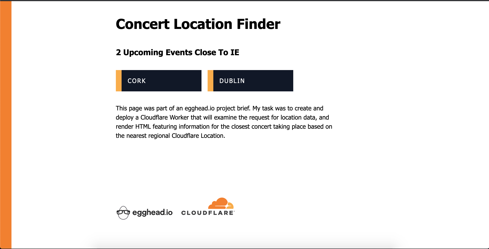

# National Concert Promoter - Cloudflare Worker

[Worker URL](https://concert-promoter-worker.webgbdev.workers.dev/)

## Project Brief
You are a developer for a national concert promoter.

Music fans from all over the world visit your site to see when and where the next show is going to be. To save them time when they visit the page, we want to show them upcoming events at a venue close to their location.

Your task is to create and deploy a Cloudflare Worker that will examine the request for location data, and render HTML featuring information for the closest concert taking place based on the nearest regional Cloudflare Location. Choose locations for testing where you have friends (or a VPN 😅) so you can prove this functionality works as expected.

## Performance

No styling or third party npm modules are prescribed. Instead, the focus is on the big takeaways that the Cloudflare network has many locations, and a Worker project supports JS.

In the course, Kristian deploys a worker that makes use of Cloudflare's IncomingRequestCfProperties to retrieve the user's country. There are additional data available here that could be used in fulfilling this project brief.

TWhile the project brief doesn't call for using a 3rd party library, the learner should be able to see how they could create an object with hardcoded demo data.

## Standards

1. The application uses Cloudflare Workers.
2. The application is deployed to the web and is useable for its intended purpose.
3. The application contains minimal bugs.
4. The application is accessible.